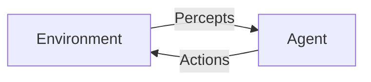

# ai-agents

## What are AI Agents?
AI agents are autonomous entities that perceive their environment, reason about it, and take actions to achieve specific goals. They can range from simple rule-based bots to advanced, learning-enabled systems that adapt over time.

---

## Table of Contents
1. [Introduction](#introduction)
2. [Types of AI Agents](#types-of-ai-agents)
3. [Agent Architectures](#agent-architectures)
4. [Key Concepts](#key-concepts)
5. [Use Cases](#use-cases)
6. [Popular Frameworks](#popular-frameworks)
7. [Example: Simple Python Agent](#example-simple-python-agent)
8. [Best Practices](#best-practices)
9. [Challenges](#challenges)
10. [Further Reading](#further-reading)

---

## Introduction
An AI agent is a system that can perceive its environment through sensors and act upon that environment through actuators. The agent uses a policy (a mapping from perceived states to actions) to decide what to do next.

---

## Types of AI Agents
- **Simple Reflex Agents:** Act only on the current percept, ignoring the rest of the percept history.
- **Model-Based Reflex Agents:** Maintain some internal state to track aspects of the world.
- **Goal-Based Agents:** Act to achieve specific goals, using search and planning.
- **Utility-Based Agents:** Choose actions based on a utility function to maximize happiness or performance.
- **Learning Agents:** Improve their performance over time by learning from experience.

---

## Agent Architectures
1. **Reactive Architecture:** Direct mapping from perception to action.
2. **Deliberative Architecture:** Uses symbolic reasoning and planning.
3. **Hybrid Architecture:** Combines reactive and deliberative approaches.
4. **Layered Architecture:** Organizes agent functions in layers (e.g., subsumption architecture in robotics).

---

## Key Concepts
- **Perception:** Gathering information from the environment.
- **Action:** Executing operations that affect the environment.
- **Policy:** The strategy used by the agent to determine actions.
- **Reward/Utility:** Feedback used to evaluate actions.
- **Learning:** Adapting behavior based on experience.

---

## Use Cases
- **Virtual Assistants:** Siri, Alexa, Google Assistant
- **Automated Trading Bots:** Stock and crypto trading
- **Game AI:** NPCs, pathfinding, adaptive difficulty
- **Robotics:** Navigation, manipulation, swarm robotics
- **Customer Support Chatbots:** Automated help desks
- **Recommendation Systems:** Personalized content delivery
- **Autonomous Vehicles:** Self-driving cars, drones

---

## Popular Frameworks
- **LangChain:** For building LLM-powered agents
- **Auto-GPT:** Autonomous GPT-4 agents
- **Microsoft Semantic Kernel:** Orchestrating AI skills and plugins
- **OpenAI Gym:** Reinforcement learning environments
- **Rasa:** Conversational AI and chatbots

---

## Example: Simple Python Agent
```python
class SimpleAgent:
    def __init__(self, name):
        self.name = name
    def perceive(self, environment):
        print(f"{self.name} perceives: {environment}")
    def act(self):
        print(f"{self.name} takes an action!")

agent = SimpleAgent("Agent007")
agent.perceive("an open door")
agent.act()
```

---

## Best Practices
- Define clear goals for your agent
- Use modular design for scalability
- Monitor and log agent decisions
- Test in simulated environments before real-world deployment
- Ensure ethical and safe operation

---

## Challenges
- Partial observability (limited information)
- Non-deterministic environments
- Balancing exploration vs. exploitation
- Real-time decision making
- Safety and alignment with human values

---

## Further Reading
- [Russell & Norvig, Artificial Intelligence: A Modern Approach](https://aima.cs.berkeley.edu/)
- [OpenAI Gym Documentation](https://www.gymlibrary.dev/)
- [LangChain Documentation](https://python.langchain.com/)
- [Auto-GPT GitHub](https://github.com/Significant-Gravitas/Auto-GPT)
- [Rasa Documentation](https://rasa.com/docs/)

---

## Diagram: Agent-Environment Loop


---

## Example: Reinforcement Learning Agent
```python
import gym
env = gym.make('CartPole-v1')
obs = env.reset()
done = False
while not done:
    action = env.action_space.sample()
    obs, reward, done, info = env.step(action)
    env.render()
env.close()
```

---

## Glossary
- **Agent:** An entity that perceives and acts
- **Environment:** The world the agent interacts with
- **Policy:** The agent’s strategy
- **Reward:** Feedback from the environment

---

## FAQ
**Q: Can agents learn on their own?**
A: Yes, learning agents adapt based on feedback and experience.

**Q: What’s the difference between an agent and a bot?**
A: All bots are agents, but not all agents are bots. Agents can be more general and autonomous.

---
